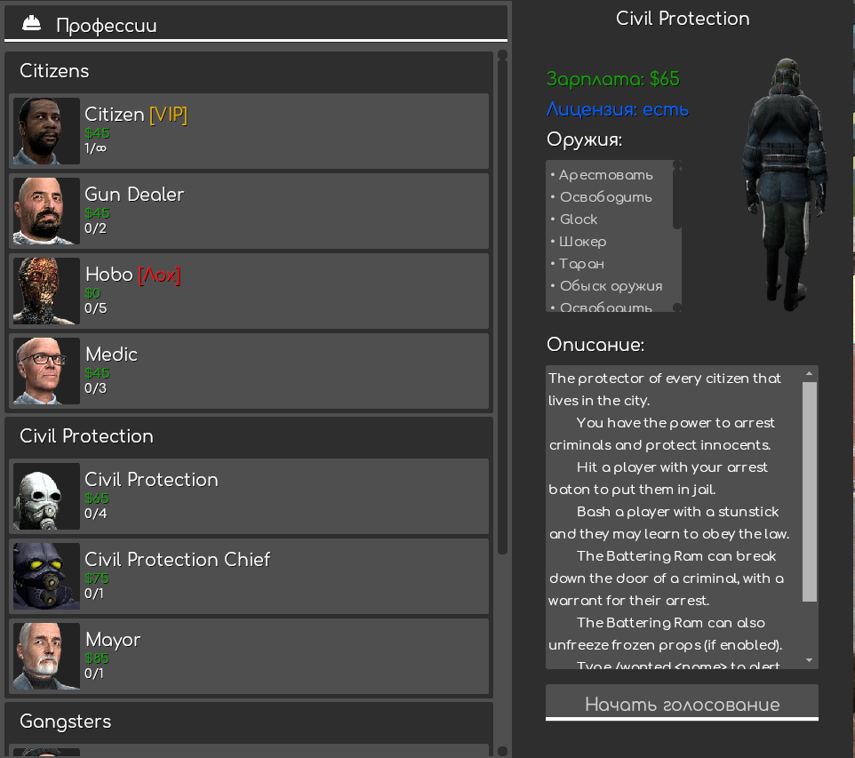
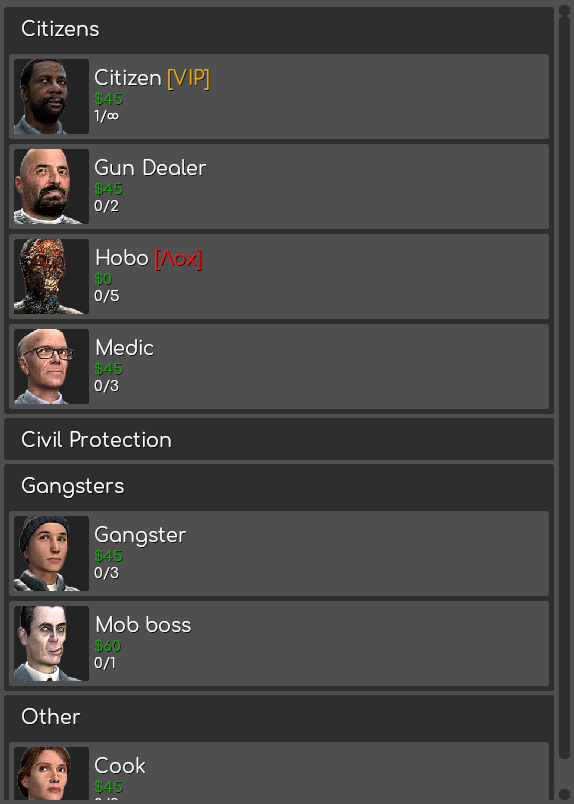
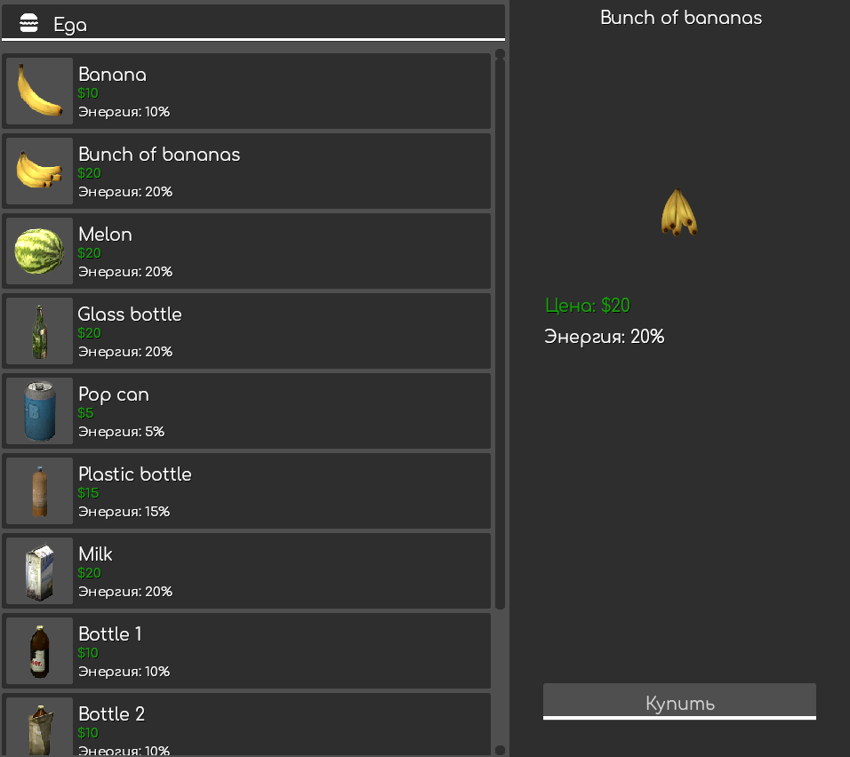

# F4

# Общий вид

## Работы

### Категории

Каждая категория работы имеет свой "столбик", который может скрываться.

### Оружия

Отображает оружия у профессии. Также имеет прокрутку, если оружия много.
В конфиг файле есть таблица отключения отображения оружия.

### Описание

Описание к важдой профессии. Также если много, имеет скролл.

### Модели

Если моделей у профессии несколько имеется возможность выбора модели.

## Вещи

## Коробки

## Продукты

