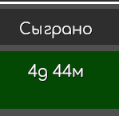
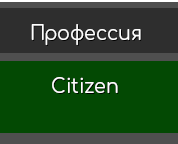

# Scoreboard

# Общий вид

## Привилегии

Вы можете настроить иконку и кастомное название для группы игроков.

## Игровое время

Отображение игрового времени.

## Профессия

Профессия.

## Имя игрока

Имя игрока с аватаркой

## Кнопки команд

Кнопки команд, пока настраиваются только в самом файле `scoreboard.lua`